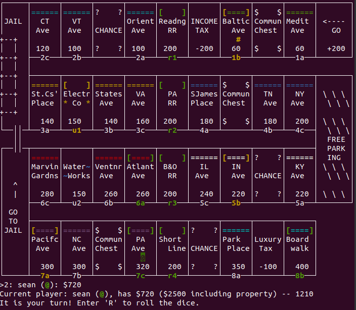

# seanopoly
Monopoly for telnet clients.
More or less the same rules as regular Monopoly.

## Installation:

    chmod +x monopoly.py
  
## To Run:
    ./monopoly.py

Runs on port 8888 by default.

## Lobby
Connect to server with a telnet client.   
For Linux this would be:
    telnet seanopolyserver.com 8888
(if the server is hosted at that address)

Server will prompt you with a list of games.  
Select one by typing in its number.  
Or you can create a new one with 'n'.  
If you had previously disconnected, you can just input your ten-letter random code to rejoin the game.  

## How to Play
* R to roll the dice
* B to buy property
* S to sell
* A to auction
* P to pass to next player
* Q to quit (not forfeit, but leave the server)
* /\<text\> to chat

## TODO
* Polish things up
* Complete chance/community cards
* Implement trading
* Handle lobby system better
* Possibly far distant future, or never: make it character, not line-based

